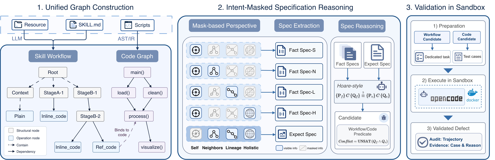

# SkillSpec

**Intent-Masked Specification Reasoning for Agent Skill Correctness**

SkillSpec formulates agent skill correctness as a Hoare-style specification reasoning problem. It checks whether a skill's encoded behavior fulfills its declared intent in reachable, in-scope scenarios, considering generalization across its intended tasks.

This repository contains the source code accompanying the paper:

> **SkillSpec: Intent-Masked Specification Reasoning for Agent Skill Correctness**  
> Yizhuo Zhang, Bo Kang, Yi Yang, Zhiyu Duan, Zhouteng Ye, and Shunkun Yang  
> arXiv preprint, 2026. [Paper](https://arxiv.org/abs/2609.06052) · [HTML](https://arxiv.org/html/2609.06052v1)


## Method Overview

The framework comprises three stages, corresponding to the CLI's `build`, `reason`, and `verify` stages.

1. **Unified Representation of Skill Artifacts.** Combine a Tree-sitter-based, language-agnostic code graph with an LLM-derived workflow DAG. Bidirectional intent–implementation bindings connect workflow operations to reachable code.
2. **Specification with Intent-Mask.** Express behavior as textual preconditions and postconditions: `{Pre} C {Post}`. *ExpectSpec* represents intended behavior; *FactSpecs* characterize encoded behavior under selected intent views. Joint reasoning examines discrepancies against source evidence to identify candidates.
3. **Validation in Sandbox.** Validate code candidates through executable probes and workflow candidates through source-grounded scenario checks, retaining conclusions and trajectories.



Intent visibility is organized into **Holistic** (global objectives and constraints), **Lineage** (inherited context), **Neighbors** (local coordination), and **Self** (target behavior). Masking balances intent-induced bias against inference with insufficient context. A specification mismatch is a candidate requiring validation.

The implementation supports **Python, JavaScript, TypeScript, and Shell**, and uses Harbor and OpenCode for sandbox validation.

## Installation

### Prerequisites

- Python **3.13 or later**.
- [uv](https://docs.astral.sh/uv/) for dependency management.
- Docker with the `docker compose` command, with the Docker daemon running, for sandbox verification and Phoenix tracing.
- Access to an OpenAI-compatible model endpoint for analysis and an OpenCode-supported provider for verification.
- Optionally, the Graphviz system executable (`dot`) to render graph images. Analysis can proceed without PNG rendering.

### Install dependencies

```bash
git clone https://github.com/IainZhang/SkillSpec.git
cd SkillSpec
uv sync --locked --extra telemetry
```

Run the commands below from the repository root. Inspect the CLI with:

```bash
uv run skillspec --help
```

### Prepare the sandbox image

Build the sandbox image and create its shared Docker network:

```bash
make image
make net
```

The image includes Python and JavaScript/TypeScript toolchains and a pinned OpenCode CLI. It is reused across analyses; the skill under analysis is supplied at runtime. Each skill uses a warm container, with a separate workspace and agent context for each candidate group.

### Set up Phoenix tracing

Phoenix tracing is required for the setup described here. Install the telemetry dependencies and start the local service before running an analysis:

```bash
uv sync --locked --extra telemetry
make env
```

The Phoenix UI is available at [localhost:6006](http://localhost:6006). The bundled service uses `admin@localhost` / `admin` for the initial sign-in and requests a password change. The supplied configuration includes a matching local tracing token.

Keep `telemetry.enabled: true` and use the endpoint and matching tracing token shown in the configuration below to export traces. To stop the tracing service:

```bash
make down
```

## Configuration

The CLI reads `config.yaml` from the current directory by default. Use `--config` to select another YAML file. Provider configurations are also available in `conf/`.

For a separate working configuration, copy the supplied file:

```yaml
llm:
  model: deepseek-flash
  url: https://api.deepseek.com
  key_from_env: DEEPSEEK_API_KEY  # OPENROUTER_API_KEY
  reasoning_effort: high
  concurrency: 4  # Maximum concurrent requests
  min_request_interval: 0.5
  max_retries: 3
  timeout: 600.0

spec:
  enable: true
  fact_views: [self, neighbors, lineage, holistic]  # ExpectSpec is always added

verify:
  enable: true  # Set false to skip sandbox validation
  sandbox:
    image: skillspec-sandbox:latest
    model: deepseek/deepseek-flash  # OpenCode provider/model; independent of llm
    key_from_env: DEEPSEEK_API_KEY  # Export this too if using another provider
    timeout: 600.0  # Seconds per agent run

output:
  dir: ./artifacts  # Output root
  log_level: info

telemetry:
  enabled: true  # Required Phoenix tracing
  endpoint: http://localhost:6006/v1/traces
  project: SkillSpec
  api_key: Skadm9zQ4wRtVx2yLpN7bGmC3dHfJ8kU  # Matches the bundled Phoenix service
```

Export the model credential before running:

```bash
export DEEPSEEK_API_KEY="<your-api-key>"
export OPENROUTER_API_KEY="<your-api-key>"
```

## Quick Start

```bash
# Run (--repo points to the directory containing SKILL.md)
uv run skillspec --repo /path/to/skill --config config.local.yaml

# Resume unfinished work
uv run skillspec --repo /path/to/skill --config config.local.yaml --resume

# Rerun a stage: build, reason, or verify (invalidates downstream results)
uv run skillspec --repo /path/to/skill --config config.local.yaml --rerun reason
```

## Outputs

Results are written to `<output.dir>/<skill_id>/`, where the skill identifier combines the manifest name with a short hash of `SKILL.md`. With the example configuration, the output root is `artifacts/`.

| Artifact | Contents |
| --- | --- |
| `snapshot/` | Saved skill source used for the run and subsequent recovery. |
| `graph.json` | Unified workflow/code graph and materialized node contexts. |
| `workflow.jsonl` | Workflow entry and node records. |
| `workflow.png`, `codegraph.png` | Graph visualizations, when rendering succeeds. |
| `specs.jsonl` | Per-node expected and factual specifications. |
| `defects.jsonl` | Candidate findings grouped by their attributed unit, with workflow/code kind. |
| `llm_calls.jsonl` | Recorded reasoning-stage model requests and responses. |
| `status.json` | Stage and node progress checkpoint. |
| `output.log` | Per-skill execution log. |
| `audit/status_<kind>.json` | Verification progress for code or workflow candidates. |
| `audit/<kind>_<index>/` | Per-group validation evidence, including `prompt.md`, `result.json`, `trajectory.json`, raw agent logs, and any retained probe files. |

## Citation

If you use SkillSpec in your research, please cite:

```bibtex
@misc{zhang2026skillspec,
  title         = {SkillSpec: Intent-Masked Specification Reasoning for Agent Skill Correctness},
  author        = {Yizhuo Zhang, Bo Kang, Yi Yang, Zhiyu Duan, Zhouteng Ye and Shunkun Yang},
  year          = {2026},
  eprint        = {2609.06052},
  archivePrefix = {arXiv},
  primaryClass  = {cs.SE},
  url           = {https://arxiv.org/abs/2609.06052}
}
```

## License

The source code is released under the [Apache License 2.0](LICENSE). Third-party software and skill repositories remain subject to their respective licenses.
